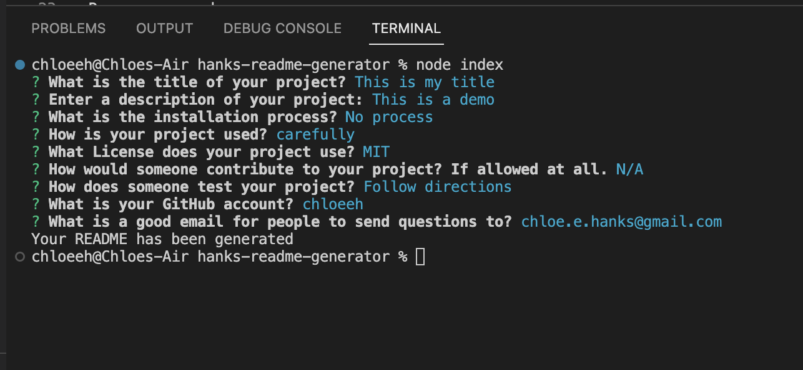
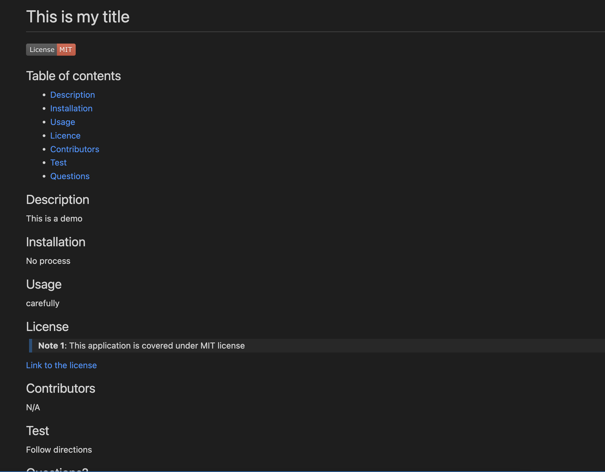
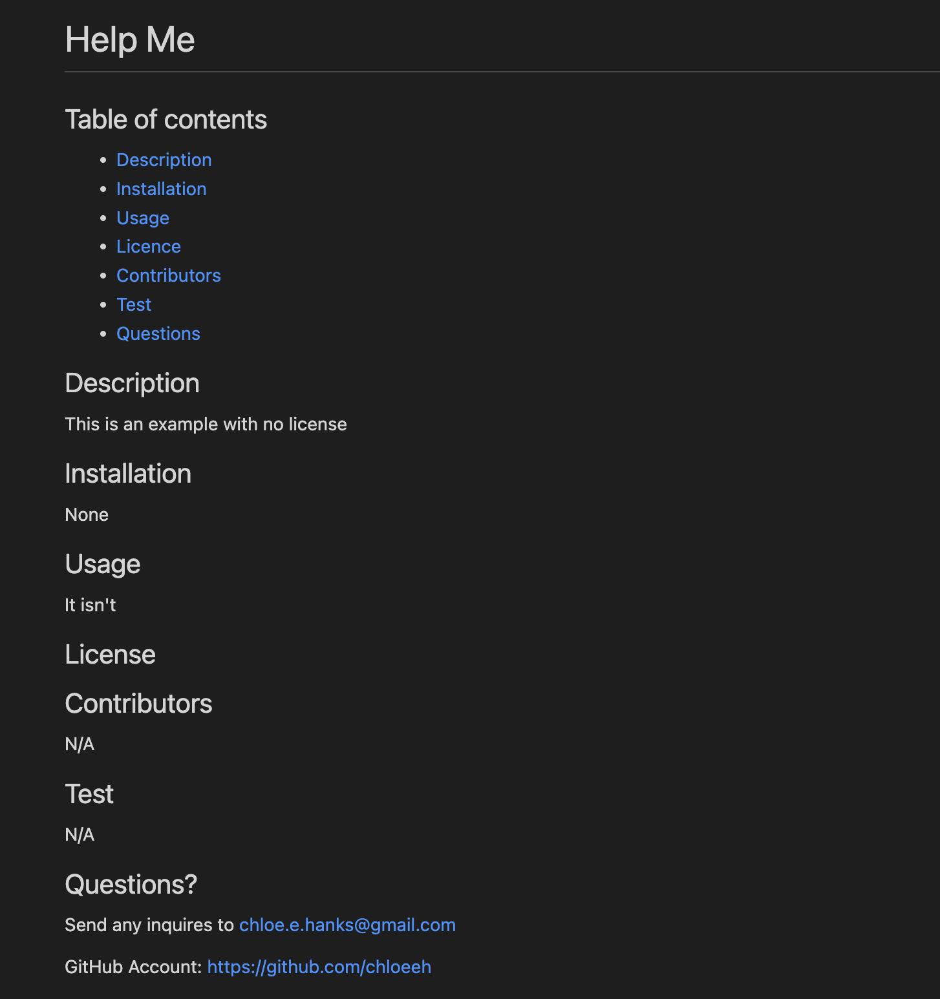

# wk9 - README Generator

## Description
The purpose of this project is to use inquirer and NodeJS to generate a professional README.md based on user's answers to the prompts from the terminal. The image below shows the command terminal with prompts generated from the js file. The blue text is the user input.

If the user does not want to use a license, then no badge is shown in the readme file, nor is there any text under the License heading. Images 2 (with license) and 3 (no license) show the difference

## Installation

N/A

## Usage

Watch the video video by opening the [Google Drive Link](https://drive.google.com/file/d/1kNzYXeb4cBiCh2_Ff9gqocihpcOBg3bo/view?usp=share_link)

## Credits

Resources used:
1) Bootcamp Pre-work Modules
2) Bootcamp 09-NodeJS
3) [MarkDown Cross-reference](https://stackoverflow.com/questions/5319754/cross-reference-named-anchor-in-markdown)

## License

Please refer to the LICENSE in the repository.